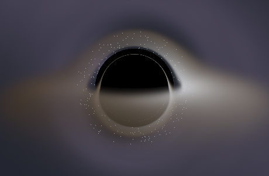

# 📱 手机门户 (Mobile Portal)

一个在本机（手机 / Termux）运行的门户网站框架——**前后端均使用 TypeScript 编写**。
门户由若干个**彼此独立的子应用**组成，每个子应用都是一个完整的小网站，由门户统一发现、展示与承载。

- 前端：原生 TypeScript（无框架、无构建工具链依赖之外的东西），响应式、适合手机。
- 后端：Node.js 原生 `http` 模块（**零运行时依赖**），负责静态资源服务与子应用发现 API。
- 微前端思想：子应用通过 `manifest.json` 自动注册；门户主页渲染应用卡片；点击后在 **iframe** 中打开该子应用（同源，隔离且互相独立）。

> 📘 **给后续 Agent / 开发者的技术速览**：[docs/TECHNICAL.md](docs/TECHNICAL.md) —— 架构、数据流、构建管线、关键不变量、真实踩过的坑与扩展方法。
> 📋 **Agent 协作规则（决策必须落文档）**：[AGENTS.md](AGENTS.md)。
> 🌐 **仓库**：<https://github.com/alpaca2333/PhonePortal>

### 目录

- [目录结构](#目录结构)
- [快速开始](#快速开始)
- [界面预览](#界面预览)
- [门户如何工作](#门户如何工作)
- [如何新增一个子应用](#如何新增一个子应用)
- [API](#api)
- [内置示例子应用](#内置示例子应用)
- [技术要点](#技术要点)
- [许可证与第三方资源](#许可证与第三方资源)

---

## 目录结构

```
portal/
├─ package.json            # 脚本：build / start / dev / launch
├─ tsconfig.json           # 全量 TypeScript 编译配置
├─ data/                   # 运行时用户数据（gitignore，不在 dist/ 内）
│  ├─ settings.json        # 设置存储（/api/settings 读写）
│  ├─ assets/<appId>/      # 外部资产目录：别的子应用「发布」进来的文件（/api/assets 写、/assets 读）
│  └─ tmp/                 # 转换 API 的临时目录（上传的 FBX 与产出的 GLB，请求结束即删）
├─ scripts/
│  ├─ build.mjs            # 原子构建：tsc → dist.next/，再换入 dist/（失败不动 dist/）
│  ├─ dev-serve.mjs        # 开发监督者（npm run dev）：构建 + 启动 + watch 源码 → 重建重启
│  ├─ verify-stick.mjs     # 摇杆/相机/设置验证：几何不变量 + 视角区（透明触摸区）yaw 映射 + 开火键位置 + 默认值 + 钳制 + 稀疏覆盖
│  ├─ verify-panel.mjs     # 设置面板 DOM 接线验证（DOM shim，无浏览器）
│  ├─ verify-burn.mjs      # 龙息弹燃烧 DoT + 火焰粒子验证（跳点/叠层/粒子/朝向）
│  ├─ verify-ammo.mjs      # 弹夹/自动换弹 + 冲锋枪验证（时序/帧率无关/散布/三参数可配置）
│  ├─ verify-props.mjs     # 室内美术验证：道具尺寸 vs 磁盘 GLB 实测 + 掩体道具不越出碰撞脚印 + 房间无缝
│  ├─ verify-shadow.mjs    # 主光阴影盒验证：矩阵与 three 一致 + 视野覆盖 + texel 吸附 + acne/翻转率光栅化实测
│  ├─ verify-spawn-cost.mjs # 每只敌人的动画预算验证：整本动画库不得被实例化（`clipAction()`=0）+ 常驻堆（旧模型 1.79MB → 现在 0.06–0.09MB）+ dispose 解绑
│  ├─ verify-characters.mjs # 角色模型验证：每个出厂 .glb 的自包含/骨架一致/朝向 +Z/10 个 clip 齐全/手持物剥离/归一化居中（含「不剥就偏」的反向断言）
│  ├─ verify-character-render.mjs # **着色器空间**验证：按 GLTFLoader 的方式装角色 + 走真实 spawnFromTemplate，用蒙皮矩阵量「画出来多大」与「描边多厚」（真机「巨大黑球」的回归门）
│  ├─ preview-model.mjs    # 离线模型预览：把 .glb 的四个正交视图（前/左/后/上）光栅化成 PNG，零依赖、无需浏览器/GPU（绑定姿势，用来挑模型）
│  ├─ verify-diag.mjs      # 卡顿归因验证（`?diag=1`）：GC / shader 编译 / 资源解析 / 长任务 / 相位的判定规则与反向用例 + DOM shim 驱动真实读数面板
│  ├─ lib/glb.mjs          # 共享 .glb 读取器（节点 TRS + 与加载器相同的居中），供上面两个脚本复用
│  ├─ verify-fbx2glb.mjs   # FBX→GLB 子应用验证：真实 FBXLoader/GLTFExporter 跑真样例（解析/合并重定向/自包含/自检/缩放/命名规则/设置 schema/「不上传」源码级断言）+ DOM shim 跑一遍「发布→覆盖→删除」
│  ├─ verify-assets.mjs    # 外部资产目录验证：起真实服务器（临时 data/ + 1MB 上限）跑发布/列表/读取/覆盖/删除 + 全部拒绝路径（截断/非 GLB/超限/坏名字/未声明接收），并断言失败的上传不会毁掉已发布的文件
│  └─ trace-shooter.mjs    # 射击子应用行为快照（重构前后 diff 必须为空）
├─ server/                 # 后端（Node + TS）
│  └─ src/
│     ├─ index.ts          # HTTP 服务器：路由、静态服务、API
│     ├─ registry.ts       # 扫描 apps/ 目录生成子应用注册表
│     ├─ settings.ts       # 设置存储：原子写 data/settings.json + 校验
│     ├─ assets.ts         # 外部资产存储：data/assets/<appId>/ 的流式上传（带上限）+ GLB 头校验 + 原子替换
│     ├─ fbx2glb.ts        # 子应用自己的 HTTP API：POST /api/fbx2glb/convert（FBX 进、GLB 出）
│     └─ fbx2glbWorker.ts  # 在 worker 线程里跑 apps/fbx2glb 的模块（+ 最小假 DOM）
├─ shell/                  # 门户外壳（前端）
│  ├─ index.html           # 门户首页
│  ├─ styles.css           # 门户样式（移动优先、深色）
│  └─ main.ts              # 主页渲染 + 哈希路由 + iframe 承载
├─ shared/
│  └─ src/
│     ├─ types.ts          # 前后端共享的 TypeScript 类型
│     └─ settings.ts       # 设置 API 的浏览器侧封装（loadSettings / saveSettings）
└─ apps/                   # 子应用目录（每个子应用=一个独立网站）
   ├─ notes/               # 📝 我的笔记（localStorage：笔记正文属于「应用内容」）
   ├─ clock/               # ⏰ 时钟 + 秒表
   ├─ calculator/          # 🧮 计算器（内置表达式解析，无 eval）
   ├─ blackhole/           # 🕳️ 黑洞（Schwarzschild 光线追踪，WebGL2）
   ├─ fbx2glb/             # 🧊 FBX → GLB 转换器（浏览器内转换，可把多个 Mixamo 动作合并成一个角色文件；一键把产物发布到游戏的外部资产目录）
   └─ shooter/             # 🎯 射击竞技场（室内掩体射击 + 视野遮挡 + 背包/物品槽位 + 备弹 + 护甲穿透等级 1–6 + 主副武器切换 + 分组设置面板：操控/画面/视野/光照）
```

---

## 快速开始

**环境要求**：Node.js ≥ 18（开发环境为 Android + Termux，实测 Node `v26.4.0` / npm `11.19.1`）。
运行时**零依赖**——后端只用 Node 内置模块；`devDependencies` 只有 `typescript` 与 `@types/node`，所以 `npm install` 很快。

```bash
git clone git@github.com:alpaca2333/PhonePortal.git
cd PhonePortal
npm install
```

在项目根目录执行：

```bash
# 1. 安装开发依赖（仅 typescript + @types/node）
npm install

# 2. 日常开发：构建 + 启动 + watch（保存即自动重建并重启服务器）—— 推荐
npm run dev

# 或者：一次性构建 + 普通启动（不 watch，改源码需重启）
npm run launch
```

启动后：

- 门户首页：<http://localhost:3000>
- 发现 API：<http://localhost:3000/api/manifest>
- 默认端口 `3000`，绑定 `0.0.0.0`（同局域网其它设备可通过 `http://<手机IP>:3000` 访问）。
- 可通过环境变量覆盖：`PORT`、`HOST`，例如 `PORT=8080 npm run dev`。

开发模式（`npm run dev`，**日常一律用这个**）：

```bash
npm run dev      # 自带轮询扫描器：构建 → 启动 → 每 800ms 扫 server/ apps/ shell/ shared/ scripts/
                 # 的 mtime 签名，变了就重建 + 重启；构建失败时保留旧 dist/ 与正在运行的服务器
```

- 只改了 `html/css/子应用 JS` 这类静态资源，浏览器刷新即可（静态文件按请求读盘，无需重启）。
- 改了 `server/`、`shared/` 的代码：watch 会自动重启，所以 `/api/manifest` 之类的接口立刻生效；**用 `npm start` 起的服务不会**，必须手动重启。
- 构建是**原子**的（编译到 `dist.next/` 再换入 `dist/`），所以写错代码不会让站点变成 404。

---

## 界面预览

本仓库在**没有浏览器的环境**里开发，WebGL 效果与触摸手感无法截图，所以只保留**能在 node 里离线复现**的图像证据：

**黑洞（`apps/blackhole`）** —— CPU 光线追踪预渲染，用来先确认物理正确、再写 GLSL：



> 射击子应用（`apps/shooter`）的美术验证不走截图，而是**数值断言**：49 个道具的尺寸直接与磁盘上的 `.glb` 实测比对（`scripts/verify-props.mjs`），角色在着色器空间里的实际绘制尺寸与描边厚度由 `scripts/verify-character-render.mjs` 钉住。模型本身可用 `node scripts/preview-model.mjs --out sheet.png apps/shooter/assets/models/*.glb` 生成四视图，但那是**可重跑的中间产物，不入库**（见 `.gitignore` 说明）。

---

## 门户如何工作

1. **发现**：服务启动后读取 `apps/*/manifest.json`，得到所有子应用。
2. **API**：`GET /api/manifest` 返回 `{ portal, apps[] }`。
3. **主页**：门户外壳（`shell`）拉取该 API，渲染应用卡片网格。
4. **打开应用**：点击卡片，哈希路由切换到 `#/app/<id>`，在同源 **iframe** 中加载该子应用，并带有返回栏与新标签页按钮。
5. **隔离**：每个子应用是独立的 HTML/CSS/JS，互不影响；应用内容（如笔记正文）存在浏览器对应的 `localStorage` 作用域，**设置则统一存在服务器**（`data/settings.json`，经 `/api/settings` 读写）。
6. **不缩放**：外壳（顶层文档）关掉了页面缩放（viewport 的 `maximum-scale=1, user-scalable=no` + `html{touch-action:manipulation}` + `.appframe{touch-action:none}` + iOS 的 `gesturestart` 兜底）。**子应用自己做不了这件事**：它们跑在 iframe 里，改自己的 `<meta viewport>` / `touch-action` 挡不住浏览器把整个门户放大（双击放大、以及双摇杆两指按法被识别成双指缩放都会中招）。代价是整个门户没有双指放大了，见 `docs/TECHNICAL.md` 第 7 节。

---

## 如何新增一个子应用

在 `apps/` 下新建一个目录（目录名 = 子应用 id），放置 `manifest.json`、`index.html`、`styles.css`、`main.ts`，然后重新构建即可，**无需改任何服务端代码**。

```
apps/<你的应用id>/
├─ manifest.json      # 注册信息（门户依赖它自动发现）
├─ index.html         # 应用入口页（引用 ./styles.css 与 ./main.js）
├─ styles.css         # 应用样式
└─ main.ts            # 应用逻辑（会被编译为 ./main.js）
```

### manifest.json 字段

```json5
{
  "id": "todo",            // 可选，默认取目录名；需为 URL 安全标识
  "name": "待办清单",      // 卡片上显示的名称（必填）
  "description": "简洁的本地待办", // 卡片描述
  "icon": "✅",            // 卡片图标（emoji 或路径）
  "color": "#2fbf71",      // 卡片强调色（hex）
  "order": 4,              // 排序，越小越靠前
  "version": "1.0.0",      // 版本号
  "entry": "/apps/todo/",  // 可选，默认为 /apps/<id>/
  "orientation": "landscape", // 可选："landscape" | "portrait"；外壳据此显示「横屏」按钮
  "assets": { "accepts": ["glb"] } // 可选：声明接收别的子应用「发布」的资产（扩展名，小写、不带点）。
                             // 声明了才有 data/assets/<id>/ 目录与 /assets/<id>/<name> 读取地址
}
```

> 目录里只有子应用的源代码；构建时 `npm run build` 会自动把 `index.html`、`styles.css`、`manifest.json` 等静态文件拷贝进 `dist/apps/<id>/`，并用 tsc 把 `main.ts` 编译成 `main.js`。

---

## API

| 方法 | 路径                   | 说明                     |
| ---- | ---------------------- | ------------------------ |
| GET  | `/api/manifest`        | 门户 + 全部子应用元数据   |
| GET  | `/api/apps/<id>`       | 单个子应用元数据         |
| GET  | `/api/portal`          | 门户信息与应用总数       |
| GET  | `/api/settings`        | 读取全部设置（按 scope） |
| GET  | `/api/settings/<scope>`| 读取某个 scope 的设置     |
| PUT  | `/api/settings/<scope>`| 覆盖写入某个 scope 的设置（≤8KB JSON 对象） |
| GET  | `/api/assets`          | 列出接收发布资产的子应用及其文件 |
| GET  | `/api/assets/<id>`     | 某个子应用已发布的资产列表 |
| PUT  | `/api/assets/<id>/<name>` | 发布一个资产（裸 body；校验扩展名 + GLB 头 + 上限后原子替换） |
| DELETE | `/api/assets/<id>/<name>` | 删除一个已发布资产 |
| GET  | `/assets/<id>/<name>`  | 读取已发布的资产（如游戏加载 `/assets/shooter/hero.glb`） |
| GET  | `/api/fbx2glb`         | 转换 API 的自描述（参数、响应头、上限） |
| POST | `/api/fbx2glb/convert` | **FBX 进 → GLB 出**：body 就是 FBX 文件，报告走 `X-Fbx2Glb-*` 响应头（贴图不支持，见下） |
| GET  | `/`                    | 门户主页（shell）         |
| GET  | `/apps/<id>/`          | 打开对应子应用           |

> **设置持久化**：所有设置项都必须存到服务器（`data/settings.json`，不在 `dist/` 内），
> 刷新页面 / 重启服务器 / 重新构建后都还在。**不要只用 `localStorage` 存设置** —— 详见
> [AGENTS.md](AGENTS.md) 的「设置与用户数据」与 [docs/TECHNICAL.md](docs/TECHNICAL.md) 第 4 节。
>
> **子应用自己的 HTTP API**：子应用之间**不能互相 import**，所以除了目录（外部资产）之外，还有一条
> 数据通道是 HTTP —— `apps/fbx2glb` 提供 `POST /api/fbx2glb/convert`（请求体是 FBX，响应体是 GLB，
> 元数据在 `X-Fbx2Glb-*` 响应头里），服务器在 worker 线程里跑**这个子应用自己的模块**（不是第二套实现）。
> **它不处理贴图**（Node 里没有图片解码器/canvas，槽会被摘掉并如实报数）——要带贴图的 GLB 请在页面里转。
>
> **外部资产（子应用之间传文件）**：一个子应用可以把产物「发布」给另一个子应用（当前是 FBX→GLB 转换器 →
> 射击竞技场的一键发布）。文件落在 `data/assets/<子应用id>/`（同样是 `dist/` 之外、gitignore），浏览器按
> `/assets/<子应用id>/<名字>` 读取；**接收方要在自己的 `manifest.json` 里声明 `assets.accepts`**，
> 否则服务端拒收。详见 [docs/TECHNICAL.md](docs/TECHNICAL.md) 第 4 节的「外部资产目录」。

---

## 内置示例子应用

- 📝 **我的笔记**（`apps/notes`）：本地保存的笔记，含添加、删除、时间戳。
- ⏰ **时钟**（`apps/clock`）：实时时钟 + 秒表。
- 🧮 **计算器**（`apps/calculator`）：支持 `+ - × ÷ %`、括号解析的正确计算器，无需网络。
- 🕳️ **黑洞**（`apps/blackhole`）：WebGL2 逐像素光线追踪，积分 Schwarzschild 光子测地线（已校验：捕获临界碰撞参数 ≈2.6rs），呈现真实引力透镜、吸积盘多普勒增亮/引力红移与光子环。
- 🧊 **FBX → GLB**（`apps/fbx2glb`）：**在浏览器里把 FBX 转成 glTF/GLB**（three r160 本地 vendor 的 `FBXLoader` + `GLTFExporter` + `GLTFLoader`），支持**贴图与 FBX 分体时按文件名补齐并内嵌进产物**、**自动减面（vendored meshoptimizer，蒙皮/UV/多材质分组都保留）**、**压缩贴图（等比降分辨率 + 不透明贴图转 JPEG，体积的真正开关）**，以及**把多个 Mixamo 动作文件合并成一个自带全部动作的角色文件**（自动挑出带蒙皮的角色本体、按骨骼名匹配重定向另一个批次的骨架、按文件名给动作命名并处理 Mixamo 那个每次都叫 `mixamo.com` 的占位 take 名、按实测高度自动做厘米→米缩放），导出后**用 `GLTFLoader` 重新读回来自检**；**转换全程不上传**（有源码级断言），唯一的服务器写入是你按下的**「发布」**——把产物一键写进某个子应用的外部资产目录 `data/assets/<应用>/`，游戏里按 `/assets/<应用>/<名字>.glb` 读取（候选目标从 `/api/manifest` 发现，不写死任何游戏）。带 WebGL 预览（无 WebGL 时降级为说明文字）。设置五组（转换 / 减面 / 贴图压缩 / 发布目标 / 预览）存服务器。
  - 完整设计决策（含「导出缩放为什么必须加在成品 JSON 上」「`Box3.setFromObject` 对 SkinnedMesh 会二次乘」两个真坑）、设置键名表、许可证见 **[`apps/fbx2glb/README.md`](apps/fbx2glb/README.md)**。
- 🎯 **射击竞技场**（`apps/shooter`）：**76×76 室内掩体射击（PvE 枪战）**，俯视角三人称（**左摇杆移动 / 右下大面积透明「视角区」转视角 / 独立开火键，角色永远朝摄像机前方**），Three.js（本地 vendor）+ glTF 骨骼动画 + 卡通渲染/角色描边。场景为 Kenney Furniture Kit 室内房间（CC0，49 个 `.glb` 仅 541KB），地上 **20 块掩体同时挡人、挡子弹、挡刀、挡火箭溅射**；敌人以**枪手为主**（见面先瞄 `0.5s`、预警线亮起、然后**照着自己那把冲锋枪的配置打空一梭子再换弹**，武器的射速/弹夹/换弹/散布全部复用 `weapons.ts` 的同一张表）+ 少量近战冲锋。**背包 / 武器 / 备弹 / 护甲穿透（1–6 级）**全部数据驱动（4 把武器：龙息喷 / 冲锋枪 / 火箭筒 / 砍刀），**视野遮挡与命中判定共用同一套视线函数**（能打到你的敌人一定看得见），模拟/渲染分离，设置分六组存服务器，`?diag=1` 打开内置卡顿剖析。声明了 `"orientation": "landscape"`，并在 manifest 里声明 `"assets": { "accepts": ["glb"] }`——**接收别的子应用发布进来的模型**（落盘 `data/assets/shooter/`，玩法上还没用起来，见它的 README）。
  - 完整设计决策、设置键名表、美术资源清单与踩坑记录见 **[`apps/shooter/README.md`](apps/shooter/README.md)**（本行只保留概览）。

---

## 技术要点

- 后端零运行依赖，只用 Node 内置模块，轻量、稳定、易于部署。
- 前端使用浏览器原生 ESM（`<script type="module"`>），无打包器，构建仅用 `tsc`。
- 样式采用 CSS 变量 + 网格布局，适配手机安全区（`safe-area`）。
- 子应用同源加载，天然隔离；`allow` 属性按需开放能力（定位/摄像头/麦克风）。
- **设置持久化在服务器**：`GET/PUT /api/settings/:scope` → `data/settings.json`（原子写、写操作串行）。存储刻意放在 `dist/` 之外，因为构建会整体替换 `dist/`。`localStorage` 只用于应用内容（如笔记正文），不用于设置。
- **跨子应用只有两条通道**：**外部资产目录**（`PUT /api/assets/<id>/<name>` → `data/assets/`）与
  **HTTP API**（子应用可以用 `server/src/<app>.ts` 暴露一个端点；今天只有 `POST /api/fbx2glb/convert`）。
  两者都不能替代「子应用之间不许互相 import」这条规则：HTTP 端点里跑的仍然是该应用自己的模块
  （在 worker 线程里，`data/tmp/` 放临时文件）。
- **外部资产也放 `data/`**：`data/assets/<appId>/` 是「一个子应用把文件交给另一个子应用」的唯一通道（`PUT /api/assets/<id>/<name>` 写入，`/assets/<id>/<name>` 读取）。它**不能**放 `apps/<id>/assets/`（dev 轮询会因此每次重建、构建会把大文件复制进 `dist/`、且会把二进制塞进 git），所以与设置同一条规则：运行时被写、体积可能大、内容属于用户 → 一律 `data/`。上传是**流式 + 上限 + 校验通过才原子替换**，坏上传不会毁掉已经能用的文件。

---

## 许可证与第三方资源

**本仓库的代码未附许可证文件**，默认**保留所有权利**（All rights reserved）。如需复用、分发或商用，请先联系仓库作者。

仓库内**第三方资源各自保留其原有许可证**，与本仓库代码的授权相互独立：

| 资源 | 位置 | 许可证 | 说明 |
| --- | --- | --- | --- |
| [Three.js](https://threejs.org) r160（`three.module.min.js` + `GLTFLoader` / `BufferGeometryUtils` / `SkeletonUtils`） | `apps/shooter/vendor/` | MIT | 本地 vendor，无 CDN 依赖；文件头保留 `@license` 声明 |
| [Three.js](https://threejs.org) r160（`three.module.min.js` + `FBXLoader` / `GLTFExporter` / `GLTFLoader` / `OrbitControls` / `SkeletonUtils` 等 addon） | `apps/fbx2glb/vendor/` | MIT | 与射击子应用的 vendor 是同版本（md5 相同，验证脚本会断言）；清单与获取方式见该目录 `README.md` |
| [meshoptimizer](https://github.com/zeux/meshoptimizer) 1.2.0（`meshopt_simplifier.js`） | `apps/fbx2glb/vendor/meshopt/` | MIT | 55KB，wasm 内嵌在同一个文件里（不发网络请求），只用于自动减面 |
| `sample.fbx`、`sample-textured.fbx`（2 骨骼蒙皮盒子 + 两个 take 的 ASCII FBX 样例，后者引用一张外部贴图）、`sample_body_diffuse.png`（4×4，81 字节） | `apps/fbx2glb/assets/` | 本仓库自有 | 手写/零依赖生成，无第三方素材；同时是验证脚本的输入 |
| Quaternius「Cyberpunk Pack」人形 `cyber_human.glb` | `apps/shooter/assets/models/` | CC0 1.0 | 可商用、可再分发、无需署名 |
| [Kenney](https://kenney.nl/assets/furniture-kit)「Furniture Kit」49 个室内道具 `.glb` | `apps/shooter/assets/props/` | CC0 1.0 | 完整来源 / 文件清单 / 再下载说明见同目录 `SOURCE.txt` |

> 引入新的外部资源（模型 / 字体 / 图标 / 库）时，必须写清**来源、许可证、体积、获取方式、降级方案**（[AGENTS.md](AGENTS.md) 规则 4）。
